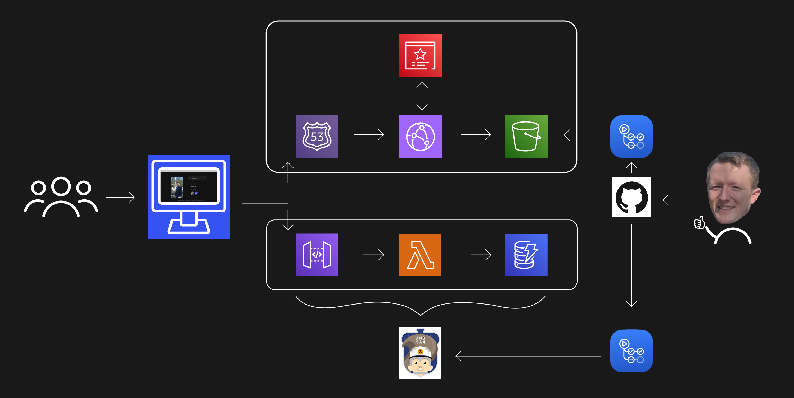

# Cloud-Resume-Challenge-AWS

## The Challenge

The [Cloud Resume Challenge](https://cloudresumechallenge.dev/docs/the-challenge/aws/) is a 16-step challenge created by [Forrest Brazeal](https://www.linkedin.com/in/forrestbrazeal) designed for beginners to get hands-on experience with some of the tools and applications that DevOps Engineers and Cloud Architects use in their day-to-day tasks. This challenge serves as a comprehensive learning opportunity for beginners, offering practical insights into various aspects of cloud computing, such as infrastructure setup, front-end development, back-end implementation, testing, and more. By completing the Cloud Resume Challenge, participants gain valuable skills and knowledge while building their own cloud-based resume website, showcasing their expertise in cloud technologies.

You can find my Cloud Resume Project [HERE!!](https://ghope.cloud/)

## Front End

The frontend is developed using S3 to store HTML, CSS, and JavaScript files. A domain is purchased through Route 53, which directs internet traffic to a CloudFront distribution. The CloudFront distribution retrieves the files from S3 and serves them to users. The use of Amazon Certificate Manager ensures a secure HTTPS connection between the client and the website, establishing a TLS connection for enhanced security.

## Back End

The backend is built using IaC (AWS SAM), which provisions API Gateway, Lambda function, and DynamoDB. When the web app is accessed, an API call triggers the Lambda function to update the visit count in DynamoDB and return the new value. This updated count is then displayed on the web page, providing real-time tracking of visits.

## Automation

To streamline the development and deployment of my cloud resume website, I have implemented an automation process using GitHub Actions and AWS SAM (Serverless Application Model).

1. **Continuous Integration:** Whenever changes are pushed to the GitHub repository, GitHub Actions triggers the automation workflow, ensuring continuous integration of updates.

2. **Deployment with AWS SAM:** The automation workflow utilizes AWS SAM to package and deploy my serverless application. This includes my resume website code and associated resources.

3. **Infrastructure-as-Code:** AWS CloudFormation, powered by the SAM template, provisions and configures the required AWS resources such as my S3, CloudFront, Route53, ACM, and serverless resources. This ensures the infrastructure is set up consistently and reliably.

4. **Automated Testing:** The automation process includes automated testing to verify the functionality and integrity of my resume website visitor counter. These tests are executed as part of the workflow, providing confidence in the deployed application.

## Areas for improvement

### Additional testing

Add a little bit more testing for my Lambda functionality.

### Smarter API

Improve the API functionality of the visitor counter to be more efficient in distinguishing repeat visitors.

### Try Terraform

I may consider reworking the IaC with Terraform. It was a route I had considered initially and would like to explore a bit more in the future.
